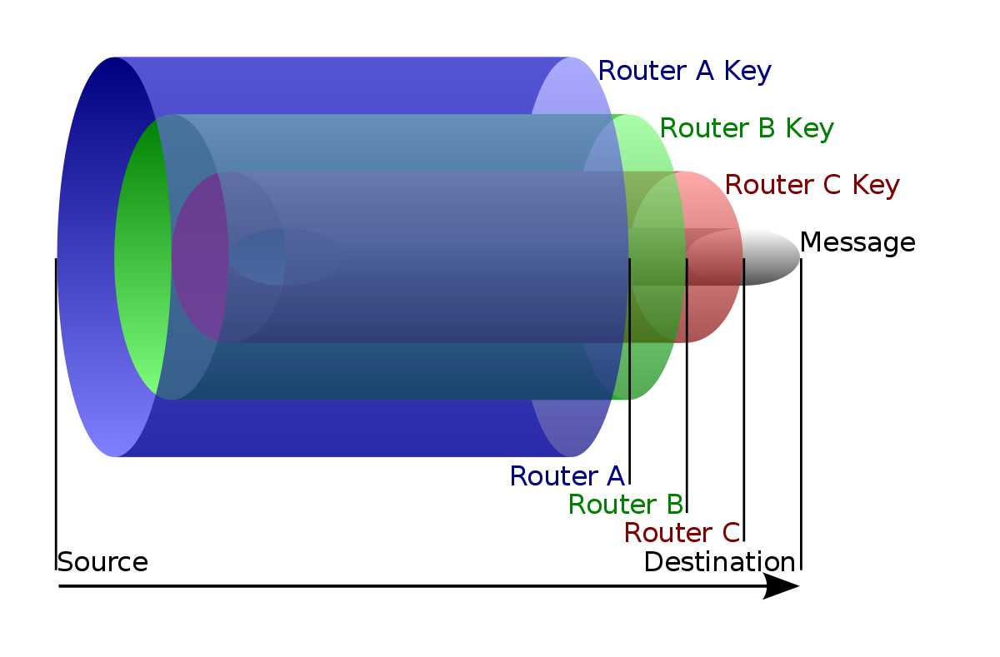
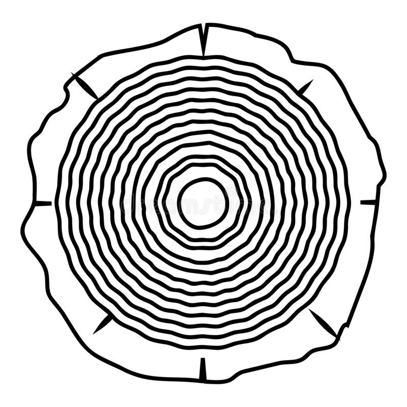

# Trunk-Routing-Protocol
[Under Developement]

We might use Onion Protocol to hide ourselves among several other nodes but the TOR browser itself is installed on our OS and our OS’ collect data regularly about the user, in order to improve the experience or other reasons, while these programs access the internet directly without using any anonymizing protocol or network. Therefore, when these program leaks information they also leak several other information. While the Onion Protocol works on the basis of each node un-wrapping the data till it reaches the final destination, a port listener on the destination can result into adversary fetching the information. 

To work around the same, the project works on developing “The Trunk Protocol”, instead of un-wrapping encryption layer on each node it would work to increase the protection by adding another layer using the public key of the receiver, where finally the receiver node decrypts each layer to achieve the requested data without any threats.

