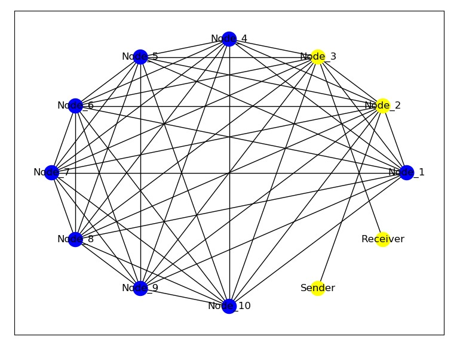

# Trunk-Routing-Protocol
[Under Developement]

We might use Onion Protocol to hide ourselves among several other nodes but the TOR browser itself is installed on our OS and our OS’ collect data regularly about the user, in order to improve the experience or other reasons, while these programs access the internet directly without using any anonymizing protocol or network. Therefore, when these program leaks information they also leak several other information. While the Onion Protocol works on the basis of each node un-wrapping the data till it reaches the final destination, a port listener on the destination can result into adversary fetching the information. 

To work around the same, the project works on developing “The Trunk Protocol”, instead of un-wrapping encryption layer on each node it would work to increase the protection by adding another layer using the public key of the receiver, where finally the receiver node decrypts each layer to achieve the requested data without any threats.

## Implementation

### Import Libraries

Import the required libraries using `pip3 install [library_name]`

Required libraries-
* pubnub
* Crypto
* binascii
* colorma

### Create key sets

Form 3 different pairs of keyset at the [pubnub's website](https://admin.pubnub.com/#/login) in order to configure the network. _(this mimics HTTPS connection)_

The key would look like - 
* Publish key - `pub-c-254457e7-0f7d-47fc-1234-3b08a21577c8`
* Suscribe key - `sub-c-bf3a2d30-88b9-11fd-9f2b-a2cedba671e8`

### RSA keys

If need you can create your own pair of RSA keyset using [_Encryption.py_](Encryption.py) else can use the one used in the code.
Keys used in the code are fetched from .privkey and .pubkey files keep them saved.

### Running the network

Open 4 seperate terminals either on same computer or seperate ones, the construction's such to provided message functionality among system's on seperate network too.

Once the terminals are ready, reach the location where file is saved and run the code using python3.
* [Sender](Sender.py) - `python3 Sender.py`
* [First Node](First_Node.py) - `python3 First_Node.py`
* [Second Node](Second_Node.py) - `python3 Second_Node.py`
* [Receiver](Receiver.py) - `python3 Receiver.py`

The sender's node functions to choose a random route for transferring from a set of nodes on the network, and displays the choosen route on the sender's terminal.
_(Close the network graph before sending the message)_

### Communicating on the network

A random network route is formed from the set of nodes available on the network to introduce randomness and save from several other threats.

Once all the nodes are up and running, you would be asked to enter message on the sender's screen with the message being processed output being displaye on each node.
The AES encrypted message, gets encrypted with another layer of protection on the sender's system and with a base change the shared output message is escaped to hide the user's data fro being reflected anywhere and stop the passing of any special character to compromise in any way.

[`Sender`](OUTPUT/Sender.jpg)

[`First_Node`](OUTPUT/First%20Node.jpg)

[`Second_Node`](OUTPUT/Second Node.jpg)

The same is repeated in each node but with a different level of protection unitl it finally reached the receiver. 
